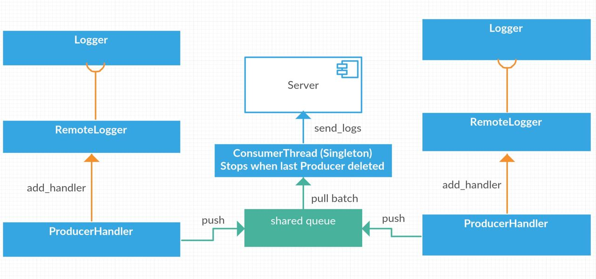

LoggerBotLogging
============================

Client part of LoggerBot.

Server on https://github.com/WesBAn/LoggerBotLoggingServer

INSTALLATION
------------
    git clone https://github.com/den-bibik/LoggerBotLogging.git
    pip install -r LoggerBotLogging

    export LOGGER_TOKEN=<LOGGER_TOKEN>
For example LOGGER_TOKEN=a5amka921jkmakguasl1kna9u6sl1241 

LOGGER_TOKEN must 32 char length
 
Example
------------

    from bot_logging import RemoteLogger
    
    logger_name = ""
    logger = RemoteLogger(logger_name, user_name, user_host)
    
    logger.info("Hello World")
    
 Structure
 ------------
 
 
 Main Class RemoteLogger add to Logger ProducerHandler. ProducerHandler and ConsumerThread created like Producer/Consumer pattern. ProducerHandler send log records to ConsumerThread throw shared variable queue. ConsumerThread get batch of log records from queue and send it to server. 
 ConsumerThread will be end when last Producer will die.
 